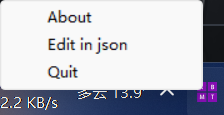
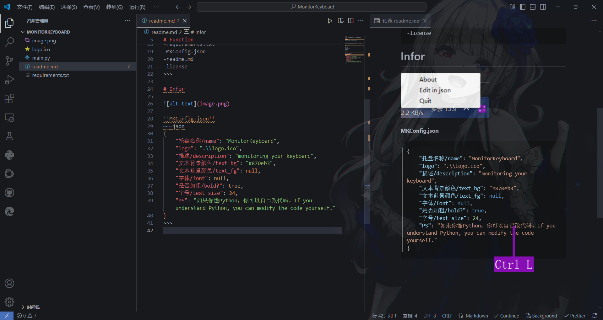
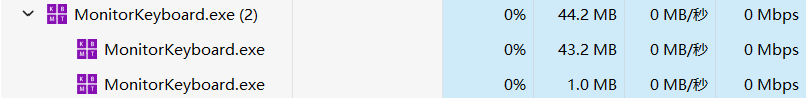

# About

A simple Program which is used to show which key you pressd.

# Function

Double click the `.exe` file to run it.

you can also clone the repo to set it yourself.

when you pressed a key, it will be shown in 2 seconds on your screen.

**can not monitor your mouse!**

File struct:
~~~
---
-main.py
-logo.ico (must)
-requirements.txt
-MKConfig.json
-readme.md
-license
~~~

# Infor
you can watch my video to know more: https://www.bilibili.com/video/BV1Vhw9euEqa/

**MKConfig.json**
~~~json
{
    "托盘名称/name": "MonitorKeyboard",
    "logo": ".\\logo.ico",
    "描述/description": "monitoring your keyboard",
    "文本背景颜色/text_bg": "#870eb3",
    "文本前景颜色/text_fg": null,
    "字体/font": null,
    "是否加粗/bold?": true,
    "字号/text_size": 24,
    "响应时间/time.sleep(?)": 0.05,
    "PS": "如果你懂Python，你可以自己改代码。If you understand Python, you can modify the code yourself."
}
~~~

Thanks every package's Contributors！